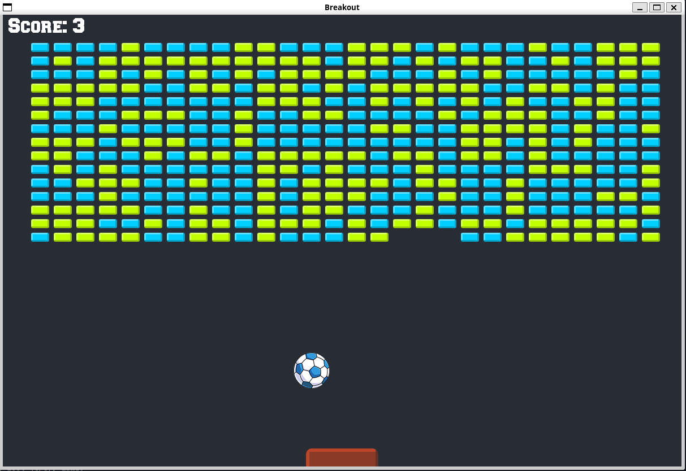

# Breakout-Clone

A breakout clone for Twitch! Written in C++ to show simple game development using object oriented programming using SFML!



## Build

### Linux

Make sure you have SFML installed. If you don't, you can install it with the following command:

```
sudo apt-get install libsfml-dev
```

Then, you can build the project with the following commands:

```
mkdir build && cd build
cmake ..
make
```
